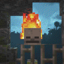
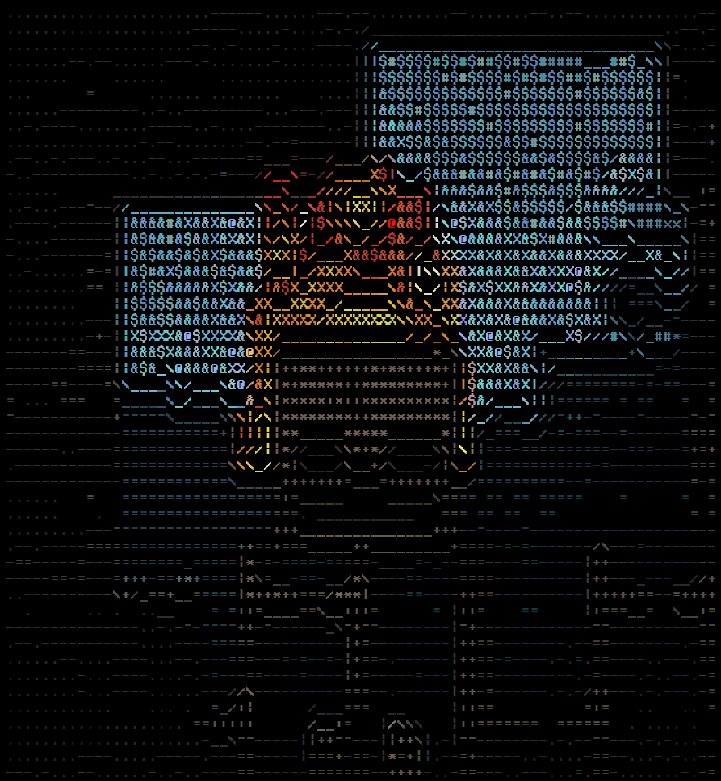

# Image to ASCII

### This was made for practice in C++ and CV algorithms

***

## Build

Install CMake and run
```bash
$ mkdir build && cd build
$ cd build
$ cmake .. && make
```
***
## Usage

Example: `./igotpicturesinmymind <file_name> <width of terminal>`
*** 
## Example


Runing `./igotpicturesinmymind ../images/mcskull.png 80` will give you



